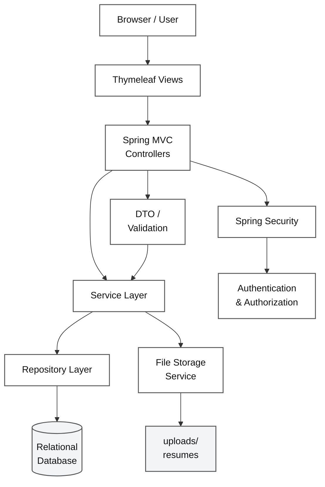
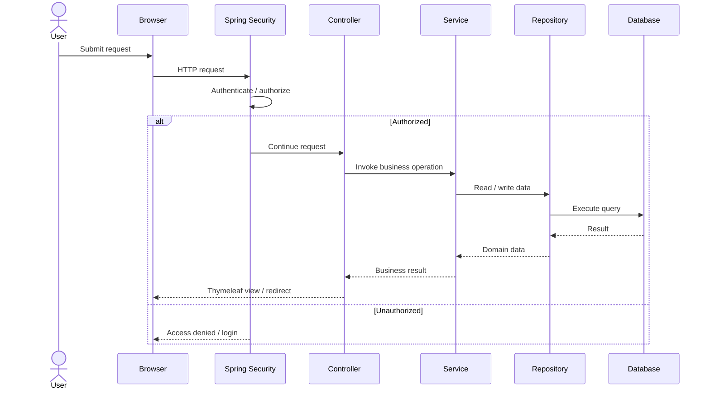
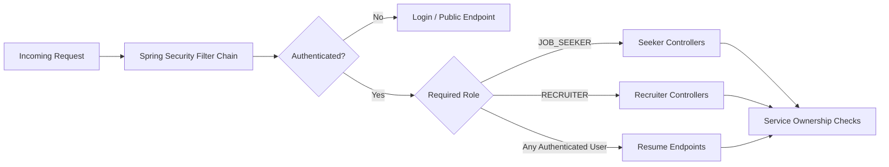
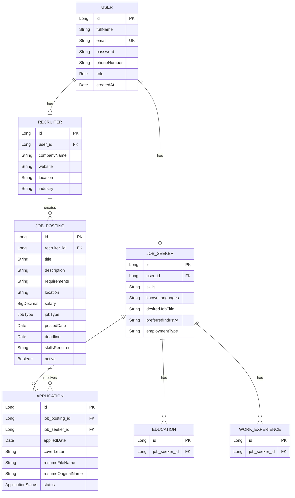
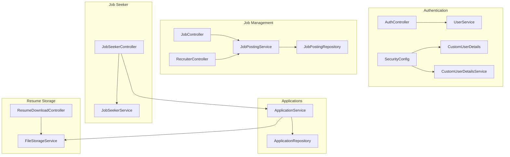
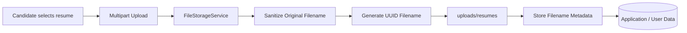
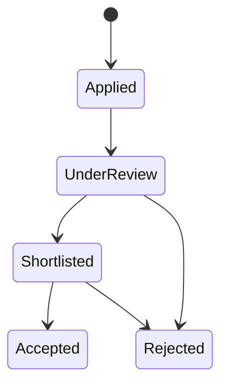

# WorkHive

<p align="center">
  
</p>

<h2 align="center">Full-Stack Job Portal & Recruitment Management System</h2>

<p align="center">
  A role-based recruitment platform built with Java 21, Spring Boot, Spring Security, Spring Data JPA and Thymeleaf.
</p>

<p align="center">
  <a href="https://github.com/Kanduriavinash/workhive"></a>
  <a href="https://spring.io/projects/spring-boot"></a>
  <a href="https://spring.io/projects/spring-security"></a>
  <a href="https://www.thymeleaf.org/"></a>
  <a href="https://www.mysql.com/"></a>
  <a href="https://www.docker.com/"></a>
</p>

---

## Table of Contents

- [Overview](#overview)
- [Core Capabilities](#core-capabilities)
- [System Architecture](#system-architecture)
- [Request & Application Flow](#request--application-flow)
- [Security Architecture](#security-architecture)
- [Data Model](#data-model)
- [Module Architecture](#module-architecture)
- [Technology Stack](#technology-stack)
- [Project Structure](#project-structure)
- [Key Components](#key-components)
- [Resume Storage Flow](#resume-storage-flow)
- [Job Search](#job-search)
- [Application Lifecycle](#application-lifecycle)
- [Getting Started](#getting-started)
- [Database Configuration](#database-configuration)
- [Docker Setup](#docker-setup)
- [Testing](#testing)
- [Production Hardening](#production-hardening)
- [Future Enhancements](#future-enhancements)
- [Project Status](#project-status)
- [Author](#author)
- [License](#license)

---

## Overview

**WorkHive** is a full-stack recruitment web application that connects **job seekers** with **recruiters** through a role-based workflow.

The system supports the complete core recruitment cycle:

**Register → Build Profile → Publish Jobs → Discover Jobs → Apply → Review Applicants → Update Application Status**

The application is implemented as a server-rendered Spring Boot application using **Spring MVC + Thymeleaf**, with **Spring Security** handling authentication and authorization and **Spring Data JPA/Hibernate** managing persistence.

### What problem does it solve?

Traditional academic job-portal projects often stop at basic job CRUD operations. WorkHive models the interaction between both sides of recruitment:

- Candidates maintain professional profiles and resumes.
- Recruiters manage company information and job postings.
- Candidates discover and apply for jobs.
- Recruiters review applications and candidate information.
- Application status provides a simple recruitment pipeline.

> **Current scope:** Functional academic/portfolio project. The core recruitment workflow is implemented; broader automated testing and production security hardening are planned improvements.

---

## Core Capabilities

### For Job Seekers

| Capability | Description |
|---|---|
| Authentication | Register and sign in as a job seeker |
| Profile | Maintain personal, contact and career information |
| Education | Add and remove education records |
| Experience | Add and remove work-experience records |
| Resume | Upload and manage a stored resume |
| Job Discovery | Browse active jobs |
| Search | Search jobs by keyword |
| Filtering | Filter jobs by employment type |
| Applications | Apply with a cover letter and optional custom resume |
| Tracking | View submitted applications and their current status |

### For Recruiters

| Capability | Description |
|---|---|
| Authentication | Register and sign in as a recruiter |
| Company Profile | Maintain company information |
| Job Management | Create, edit, activate/deactivate and delete jobs |
| Job Details | Manage description, requirements, salary, deadline and skills |
| Applicant Review | View applicants for individual jobs |
| Applicant Management | View company-wide applications |
| Candidate Profiles | Inspect education and work experience |
| Resume Access | Access submitted resumes |
| Status Management | Update application status |

### Supported Job Types

- Full Time
- Part Time
- Remote
- Internship
- Contract

---

# System Architecture

WorkHive follows a **layered MVC architecture**. Each layer has a focused responsibility, which keeps HTTP handling, business rules and persistence separate.



### Architecture layers

| Layer | Responsibility | Main Package |
|---|---|---|
| Presentation | HTML pages, forms, navigation and user interaction | `templates/` |
| Controller | HTTP routes, request handling and page navigation | `controller/` |
| DTO | Form/request data and validation | `dto/` |
| Service | Business rules and application workflows | `service/` |
| Repository | Database access and queries | `repository/` |
| Model | Domain entities and enums | `model/` |
| Security | Authentication, authorization and user identity | `config/` |
| Storage | Resume file persistence and retrieval | `FileStorageService` |

This separation allows the application to evolve without putting database logic directly inside controllers.

---

# Request & Application Flow

A typical request passes through the application in the following order:



### Example: applying for a job

```text
POST /apply/{jobId}
        │
        ▼
JobSeekerController
        │
        ▼
ApplicationService
        │
        ├── Check job is active
        ├── Check duplicate application
        ├── Check resume availability
        ├── Store custom resume if provided
        └── Create Application
                │
                ▼
       ApplicationRepository
                │
                ▼
           Database
```

The controller handles the HTTP request; the service enforces the recruitment rules; the repository persists the result.

---

# Security Architecture

Security is handled primarily by **Spring Security**.



### Implemented security controls

- BCrypt password hashing.
- Role-based access control.
- Custom authentication success handling.
- Protected seeker routes.
- Protected recruiter routes.
- Authenticated resume access.
- Logout with session invalidation.
- Session cookie cleanup on logout.
- CSRF protection through Spring Security, with the H2 console explicitly excluded for local development.
- Ownership checks in service-layer operations.
- Duplicate application prevention.
- Filename sanitization and UUID-based stored resume filenames.

### Route authorization

| Route | Access |
|---|---|
| `/` | Public |
| `/jobs` | Public |
| `/jobs/{id}` | Public |
| `/register` | Public |
| `/login` | Public |
| `/seeker/**` | Job Seeker |
| `/apply/**` | Job Seeker |
| `/recruiter/**` | Recruiter |
| `/resumes/**` | Authenticated user |

---

# Data Model

The core domain is centered around users, role-specific profiles, jobs and applications.



### Important persistence rules

- A user has a role: `ROLE_JOB_SEEKER` or `ROLE_RECRUITER`.
- Recruiters own their job postings.
- Job seekers own their profiles, education and experience.
- Applications connect a job seeker to a job posting.
- The database enforces uniqueness for a job seeker + job posting application pair.
- Recruiter service operations verify ownership before modifying jobs or applications.

---

# Module Architecture



---

# Technology Stack

| Category | Technology |
|---|---|
| Language | Java 21 |
| Backend | Spring Boot 3.3.5 |
| Web | Spring MVC |
| Security | Spring Security |
| View Layer | Thymeleaf |
| Persistence | Spring Data JPA + Hibernate |
| Database | H2 / MySQL 8 |
| Validation | Spring Validation |
| Frontend | HTML, CSS, Bootstrap 5.3.3, Bootstrap Icons |
| Build | Maven |
| Testing | Spring Boot Test, Spring Security Test |
| Containerization | Docker + Docker Compose |
| Version Control | Git + GitHub |

---

# Project Structure

```text
workhive/
├── src/
│   ├── main/
│   │   ├── java/com/workhive/
│   │   │   ├── config/
│   │   │   │   ├── CustomAuthenticationSuccessHandler.java
│   │   │   │   ├── CustomUserDetails.java
│   │   │   │   ├── CustomUserDetailsService.java
│   │   │   │   ├── DataInitializer.java
│   │   │   │   └── SecurityConfig.java
│   │   │   │
│   │   │   ├── controller/
│   │   │   │   ├── AuthController.java
│   │   │   │   ├── JobController.java
│   │   │   │   ├── JobSeekerController.java
│   │   │   │   ├── RecruiterController.java
│   │   │   │   └── ResumeDownloadController.java
│   │   │   │
│   │   │   ├── dto/
│   │   │   ├── model/
│   │   │   ├── repository/
│   │   │   └── service/
│   │   │
│   │   └── resources/
│   │       ├── static/
│   │       │   ├── css/
│   │       │   └── images/
│   │       ├── templates/
│   │       │   ├── fragments/
│   │       │   ├── seeker/
│   │       │   └── recruiter/
│   │       └── application.properties
│   │
│   └── test/
│       └── java/com/workhive/
│
├── Dockerfile
├── docker-compose.yml
├── pom.xml
└── README.md
```

---

# Key Components

### Controllers

| Controller | Responsibility |
|---|---|
| `AuthController` | Home, login, registration and authentication-related navigation |
| `JobController` | Public job browsing, searching and job details |
| `JobSeekerController` | Candidate profile, education, experience, resume and applications |
| `RecruiterController` | Company profile, jobs, applicants and application statuses |
| `ResumeDownloadController` | Authenticated resume retrieval |

### Services

| Service | Responsibility |
|---|---|
| `UserService` | Registration, password hashing and role-specific profile initialization |
| `JobPostingService` | Job creation, search, updates, ownership and status management |
| `JobSeekerService` | Candidate profile and professional information |
| `RecruiterService` | Recruiter/company profile management |
| `ApplicationService` | Application workflow, validation, ownership and status changes |
| `FileStorageService` | Resume file storage and retrieval |

---

# Resume Storage Flow

WorkHive separates **resume metadata** from the physical file.



For an application with a custom resume, the stored filename and original filename are associated with the application.

The current implementation supports PDF and DOCX content types when serving resumes, while other stored files fall back to a generic binary content type.

---

# Job Search

Job discovery supports:

- Keyword search.
- Employment-type filtering.
- Active-job filtering.
- Newest-first ordering.

The keyword search checks multiple fields:

```text
Keyword
   │
   ├── Job title
   ├── Location
   ├── Required skills
   └── Recruiter company name
```

This is implemented through `JobPostingRepository.searchJobs(...)` and is exposed through the public jobs page.

---

# Application Lifecycle

The application workflow is intentionally simple and easy to follow.



### Application rules

Before an application is created, the service checks that:

1. The job is active.
2. The candidate has not already applied.
3. A resume exists or a custom resume is supplied.
4. The application belongs to the correct candidate/job relationship.

Recruiters can update the status only for applications belonging to their own job postings.

---

# Getting Started

## Prerequisites

Install:

- **JDK 21**
- **Maven 3.9+**
- **Git**
- **MySQL 8** if using MySQL
- **Docker Desktop** if using the containerized setup

Verify Java:

```bash
java -version
```

Verify Maven:

```bash
mvn -version
```

## Clone the repository

```bash
git clone https://github.com/Kanduriavinash/workhive.git
cd workhive
```

## Run with Maven

```bash
./mvnw spring-boot:run
```

On Windows:

```bash
mvnw.cmd spring-boot:run
```

The application uses port **8080** by default.

Open:

```text
http://localhost:8080
```

---

# Database Configuration

The default configuration uses an **in-memory H2 database**, which is convenient for local development and demonstrations.

The project also contains MySQL configuration for persistent database usage.

### MySQL setup

Create a database:

```sql
CREATE DATABASE workhive;
```

Configure credentials using environment variables rather than committing secrets:

```properties
spring.datasource.url=jdbc:mysql://localhost:3306/workhive
spring.datasource.username=${DB_USERNAME}
spring.datasource.password=${DB_PASSWORD}
```

> Do not commit real database passwords or production credentials to Git.

---

# Docker Setup

The repository includes:

- `Dockerfile`
- `docker-compose.yml`

A typical containerized workflow is:

```bash
docker compose up --build
```

Then open:

```text
http://localhost:8080
```

For public or production deployment, database credentials should be supplied through environment variables or a secret manager.

---

# Testing

The project currently includes Spring Boot test infrastructure and a context-load test.

Run:

```bash
mvn test
```

Current automated coverage is intentionally limited. Future testing should expand into:

- Controller tests.
- Service-layer unit tests.
- Repository tests.
- Authentication and authorization tests.
- Application workflow integration tests.
- File-upload validation tests.

---

# Production Hardening

WorkHive is a portfolio/academic project rather than a production recruitment service. Before production deployment, the following should be strengthened:

### Secrets

- Remove any real credentials from configuration/history.
- Use environment variables or a secret manager.
- Rotate credentials if a real password has ever been committed.

### File Upload Security

- Validate file type using server-side content inspection.
- Restrict accepted extensions and MIME types.
- Enforce stronger file-size limits where appropriate.
- Store uploaded files outside the publicly served application directory.
- Strengthen path-boundary validation.

### Resume Authorization

Resume access should be further refined so that a user can access only resumes they are authorized to view for a legitimate recruitment relationship.

### Database

- Use production database credentials from secrets.
- Replace `ddl-auto=update` with controlled migrations.
- Disable or restrict the H2 console outside development.

### Testing

Expand automated security, integration and workflow coverage before production use.

---

# Future Enhancements

The current architecture provides a foundation for extending WorkHive without replacing its core modules.

### Candidate Experience

- Profile completion indicator.
- Saved jobs.
- Recommended jobs.
- Application withdrawal.
- Better application timeline.

### Recruiter Experience

- Applicant pipeline dashboard.
- Interview scheduling.
- Recruiter notes.
- Advanced applicant filtering.
- Job analytics.

### Platform

- Email notifications.
- Pagination and advanced search.
- REST API layer.
- Database migrations with Flyway.
- Cloud object storage for resumes.
- CI/CD pipeline.
- Broader automated test coverage.

---

# Project Status

| Area | Status |
|---|---|
| User registration & login | Implemented |
| Role-based authorization | Implemented |
| Job seeker profile | Implemented |
| Recruiter/company profile | Implemented |
| Job posting management | Implemented |
| Job search & filtering | Implemented |
| Resume upload | Implemented |
| Job applications | Implemented |
| Duplicate application prevention | Implemented |
| Application status management | Implemented |
| Docker setup | Included |
| Basic automated testing | Included |
| Comprehensive automated testing | Planned |
| Production security hardening | Planned |
| Email notifications | Planned |
| Advanced analytics | Planned |

---

# Why WorkHive Is a Strong Engineering Project

WorkHive demonstrates more than frontend CRUD functionality. The project brings together:

- Layered Spring Boot architecture.
- Role-based authentication and authorization.
- Database-backed domain modelling.
- Service-layer business rules.
- Repository-level search queries.
- File upload and storage.
- Candidate and recruiter workflows.
- Ownership validation.
- Application lifecycle management.
- Docker-based deployment setup.
- Automated test infrastructure.

The architecture is also extensible: additional features such as notifications, interview scheduling, analytics or a REST API can be introduced without moving business logic into the presentation layer.

---

# Author

**Avinash Kanduri**

- GitHub: [Kanduriavinash](https://github.com/Kanduriavinash)
- Portfolio: [kanduriavinash.github.io/Portfolio](https://kanduriavinash.github.io/Portfolio)

---

# License

No `LICENSE` file is currently included in the repository.

If this project is intended for open-source distribution, a license such as MIT can be added explicitly.
